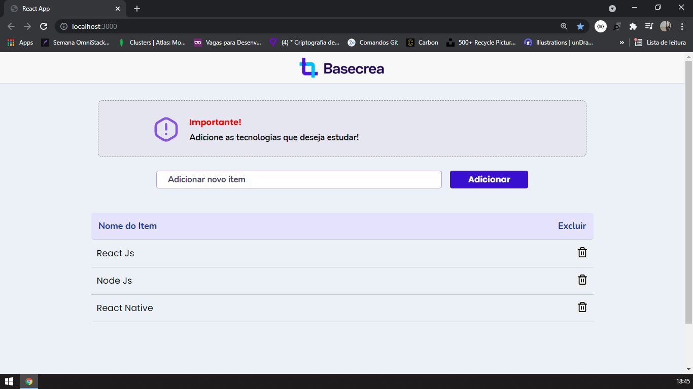

> Status do Projeto: Concluido :heavy_check_mark:

### Lista todas as palavras digitadas pelo usuário
- Cadastro items
    - Lista de items digitadas pelo usuário
    - Remoção de items 

### Principais conceitos do ReactJs que foram ultilizados  

- [X] Componentes
- [X] Imagens
- [X] Estado e imutabilidade
- [X] Propriedades do React
      - Default Props
      - PropTypes

- [X] Ciclo de Vida dos Componentes
      - componentDidMount ( Ele é execultado assim que o componente aparece em tela. )
      - componentDidUpdate  ( Ele é execultado sempre que ouver alterações nas props ou estado. )
      - componentWillUnmount ( Ele é execultado quando o componente deixa de existir. )

## Linguagens e libs utilizadas :books:

- [ReactJs] (https://pt-br.reactjs.org/):
- [HTML] (https://developer.mozilla.org/pt-BR/docs/Web/HTML):
-[CSS] (https://developer.mozilla.org/pt-BR/docs/Web/CSS):

## Imagem do front-end da aplicação

